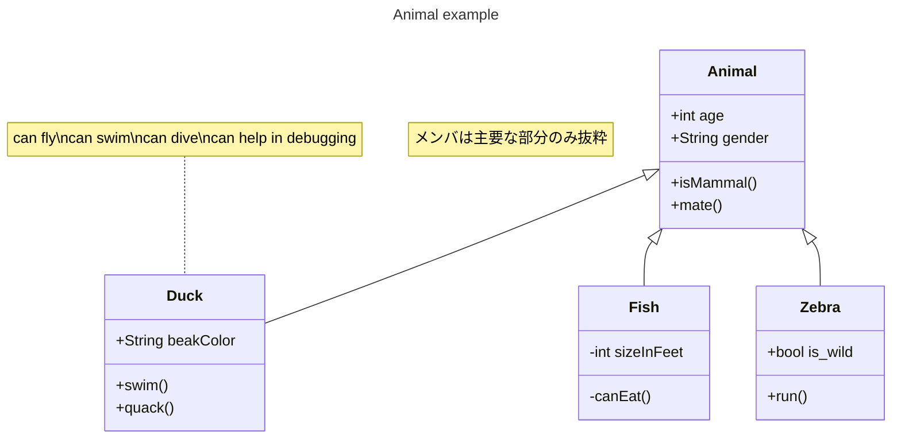

# Hide And Beep　

# description 
* タイトル:Hide & Beep
* ジャンル:アクション&ホラー
* ターゲットプラットフォーム:PC
* 制作期間 2022/11/14〜2022/12/14
* [Proposal Document](./HideAndBeep_Proposal.pdf)

# Demo
**Pleaze click image, then video will start.**

# Rule
* プレイヤーは門を開けて小学校を**脱出すること**が目的です。 
* 敵のゾンビに触れてしまうと**ゲームオーバー**です。 
* 各部屋には、**インタラクトできるオブジェクト**があります。 
* 大きな音を出すオブジェクトに触ると、**ゾンビを怯ませる**ことができます。 
* しかし、**音のなるオブジェクトは、ゾンビを引き寄せる原因**にもなります。 
* うまくゾンビを誘導して、**隙を狙って脱出**しましょう。 

# Features
* マップ上の音を管理し、優先度の高い順にゾンビが索敵します。 
 
* PUN2（PhotonUnityNetworking2）を用いたP2P通信 
 

# Requirement
* Unity 2021.3.11f1

# Note
this repository rid font assets off because the size is too large.
so you need to download font assets corresponding to Japanese.

# Author
* 一ノ宮綾平
* 九州デザイナー学院ゲームCG学科ゲームプログラミング専攻

# Class Diagram (now on Creating)

